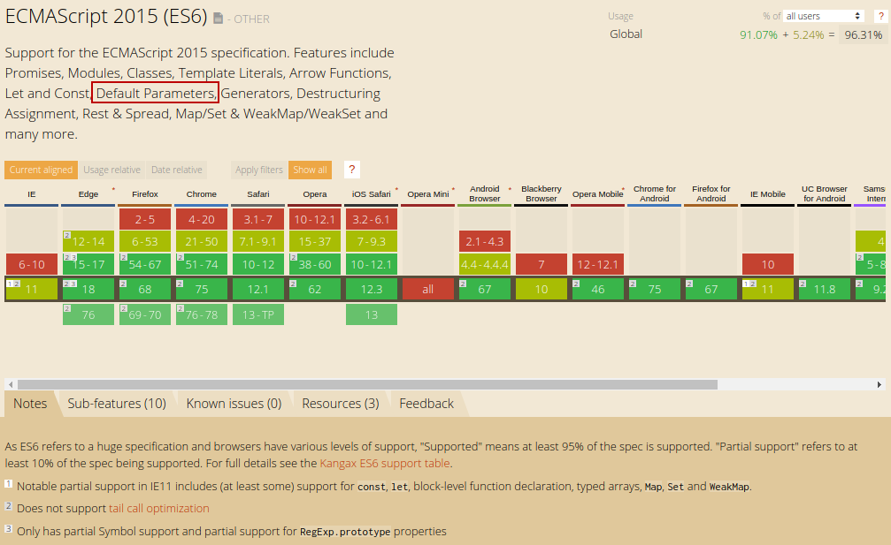

# Javascript 201


  Autor      Andrés Reyes V.

  Versión    1.0

  TODO       Separar los howtos a un archivo distinto

  Changelog  0.1 Oulining, 0.2 Acerca de, 0.3 Hasta Array.prototype, 0.4 Selectores y howtos, 1.0 Limpieza y publicación.

---

- [Javascript 201](#javascript-201)
  * [Acerca de este documento](#acerca-de-este-documento)
  * [Disclaimer](#disclaimer)
  * [Como usar este documento](#como-usar-este-documento)
  * [Donde conseguir ayuda](#donde-conseguir-ayuda)
  * [ECMAScript 5](#ecmascript-5)
  * [Undefined vs null](#undefined-vs-null)
  * [Protegiendonos contra undefined y null](#protegiendonos-contra-undefined-y-null)
  * [Argumentos por defecto, la forma correcta](#argumentos-por-defecto--la-forma-correcta)
  * [Modo estricto](#modo-estricto)
    + [Activando el modo estricto](#activando-el-modo-estricto)
  * [Binding](#binding)
    + [This](#this)
    + [Binding implícito](#binding-impl-cito)
    + [Binding explícito](#binding-expl-cito)
  * [Array.prototype](#arrayprototype)
    + [Array.prototype.forEach](#arrayprototypeforeach)
    + [Array.prototype.map](#arrayprototypemap)
    + [Array.prototype.filter](#arrayprototypefilter)
    + [Polyfill métodos Array.prototype](#polyfill-m-todos-arrayprototype)
      - [Polyfill forEach](#polyfill-foreach)
      - [Polyfill map](#polyfill-map)
  * [Selectores. La forma correcta](#selectores-la-forma-correcta)
    + [document.querySelector](#documentqueryselector)
    + [document.querySelectorAll](#documentqueryselectorall)
    + [Selectores](#selectores)
      - [Referencia de selectores](#referencia-de-selectores)
    + [Ejemplos](#ejemplos)
    + [NodeList y HTMLCollection](#nodelist-y-htmlcollection)
      - [Alternativa 1](#alternativa-1)
      - [Alternativa 2](#alternativa-2)
  * [Howtos](#howtos)
    + [Insertar un elemento html en una posición determinada](#insertar-un-elemento-html-en-una-posici-n-determinada)
    + [Relocalizar un elemento html](#relocalizar-un-elemento-html)

---

## Acerca de este documento

Este documento es un repositorio de buenas practicas en el desarrollo moderno con Javascript, principalmente orientado a las capacidades del estándar ECMAScript 5. Su objetivo es ser material de referencia rápida y consulta. No esta diseñado para ser una introducción básica a javascript.

---

## Disclaimer

El material y el código mostrados en este documento son de autoría original, excepto en los casos donde se indica. Si bien se ha intentado probar el código, pueden haber errores como en cualquier otro dominio. Es su responsabilidad probar exhaustivamente si decide usar el código de estos ejemplos en su desarrollo.

---


## Como usar este documento

Para obtener el máximo provecho de este documento se debe tener nociones básicas de programación y un dominio básico de javascript (tipos de datos, definición de funciones).

---

## Donde conseguir ayuda

  1. [Especificación estándar ECMAScript 5. Edición 5.1 Junio 2011](http://www.ecma-international.org/ecma-262/5.1/ECMA-262.pdf)
  2. [Mozilla Developer Network docs](https://developer.mozilla.org/es/search?q=javascript&topic=apps&topic=html&topic=css&topic=js&topic=api&topic=canvas&topic=svg&topic=webgl&topic=mobile&topic=webdev&topic=http&topic=webext&topic=standards)

---

## ECMAScript 5

ECMAScript es una especificación de lenguaje de programación. En pocas palabras, define como debe ser el lenguaje. La mayoría de los navegadores web implementa esta especificación, dando curso a lo que conocemos como Javascript.
ECMAScript 5, o ES5, corresponde a la especificación del lenguaje publicada en 2009, comenzando su implementación gradual en los navegadores a partir de ese año.
ECMAScript 5 incluyó muchas mejoras y caracteristicas nuevas que nos ayudan a desarrollos mas eficientes.

* Directiva use strict
* String.trim()
* Array.prototype. ...
* Array.lastIndexOf()
* JSON.parse()
* JSON.stringify()
* Date.now()

[Tabla de soporte de ECMAScript 5 en navegadores](https://caniuse.com/#feat=es5)


---

## Undefined vs null

Puede parecer un poco confusa la diferencia entre estos elementos, pero el asunto es uno de semántica. `Undefined` significa que una variable o función no existe, o ha sido declarada y no se le ha asignado valor alguno. `Null` por su parte, es un valor válido, puede ser asignado a una variable como la representación de la no existencia de valor. `Undefined` es un tipo de dato en si mismo, mientras que `null` es un objeto.

```javascript
/* Este es un ejemplo de código Js */

var a;     //Como no se se asigna valor, a es undefined.

console.log(a); //undefined

a = null;  //Para que una variable contenga el valor null, debemos asignarselo programáticamente.

console.log(a); //null

```

---

## Protegiendonos contra undefined y null

Uno de los problemas mas comunes que enfrentamos los desarrolladores Js, es el intentar acceder a una variable, o a la propiedad de un objeto, teniendo este el valor de `undefined` o `null`.

```javascript
/* Este es un ejemplo de código Js */

var a;

var b = a.propiedad;  //Esto genera una excepción TypeError: a.propiedad is undefined

var elementoQueNO_existe = document.getElementById("elemento-no-existe");
var v = elementoQueNO_existe.value;   //Esto genera una excepción TypeError: elementoQueNO_existe is null

```

Para prevenir estos molestos problemas, podemos usar las distintas versiones del `Hack de protección contra undefined`

```javascript
/* Este es un ejemplo de código Js */

var e = document.getElementById("elemento-no-existe");

/*
    Lo siguiente significa: Si e no es nulo ni indefinido, usa su propiedad value y guardala en v, sino, usa el objeto anonimo y deja en v el valor de su propiedad value, en este caso ''
*/
var v = (e || {value : ""}).value; 

/* Se puede usar también la versión larga */
if (e && e.value) {
    v = e.value;
}

```

---

## Argumentos por defecto, la forma correcta

Muchos lenguajes de programación nos ofrecen un medio para definir valores por defecto para los parámetros de nuestras funciones. por ejemplo en PHP podemos definirles de la siguiente forma:

```php
<?php
/* Este es un ejemplo en código PHP */
function ejemploParametrosPorDefecto(a = '', b = 0, c = false)
{

}

```

Javascript también nos permite hacerlo de esa manera, pero solo desde su especificación ECMAScript 6. Si debemos dar soporte a navegadores antiguos, debemos comparar los parámetros contra undefined.

```javascript

/* Este es un ejemplo en código Js */
function js_default_params(a, b, c, d) {
    if ( a == undefined ) {
        a = 100;
    }

    /* Podemos usar la versión corta, usando la conversión a falsey o truthy de Js, en la que evalua undefined como false */
    if (!b) {
        b = 100;
    }

    c = (c || 100); // Podemos usar también la versión de comparación corta.

    d = (typeof d != 'string' ? 'hola' : d); // Podemos usar el operador ternario y el operador typeof

}

```

Otra forma de revisar los parametros, es accediendo al objeto [arguments](https://developer.mozilla.org/es/docs/Web/JavaScript/Referencia/Funciones/arguments)

[Tabla de soporte de navegadores para ES6](https://caniuse.com/#search=Default%20Parameters)



---

## Modo estricto

Introducido en la revisión ECMAScript 5, Strict Mode permite poner nuestros programas, funciones, o en definitiva cualquier ámbito, en un contexto operativo estricto. Este contexto estricto previene ciertas acciones y arroja mas excepciones, proveyendo muchas veces al usuario con mas información.
En pocas palabras, el modo estricto se trata de una variante del estándar que es menos permisiva con ciertos tipos de comportamiento en el código.

### Activando el modo estricto

Simplemente escribe `"use strict";` al principio del ámbito donde lo necesites.

```javascript

function soyEstricta() {
  "use strict";
  // ... código
}

```

Fijate que la sintaxis para activar el modo estricto es un simple estamento string, lo que significa que los navegadores que soporten ES5 al llegar a este estamento activarán el modo estricto, mientras que aquellos navegadores que no lo soporten, simplemente ignorarán el estamento, sin arrojar una excepción.

El modo estricto, por ejemplo, arroja una excepción cuando intentamos usar una variable que no ha sido declarada. Ejemplo:

```javascript

var aBc = 20

function noSoyEstricta() {
    abc = 10; //No provoca excepción, el código continua ejecutandose, pero puede dar paso a errores lógicos
}

function soyEstricta() {
  "use strict"; //Al estar use strict dentro de la función, solo el contenido de la función entra en modo estricto, sin afectar al exterior.
  abc = 10;  //Arroja una excepción debido a que 'a' no está definida.
}

```

Definir una propiedad de un objeto mas de una vez causara una excepción.

```javascript

function soyEstricta() {
  "use strict";
  var a = { prop : true, prop : true }; //arrojará una excepción debido a propiedad ya definida.
}

```

Puede parecer un poco extraño el buscar a proposito que el sistema falle. Pero corresponde a una moderna línea de pensamiento, el principio [fail fast](https://medium.com/@christian.ppl/introduction-to-the-fail-fast-principle-in-software-development-865ccab28979).

John Resig, el Ninja Javascript developer, creador de JQuery, habla extensivamente sobre el modo estricto en [este artículo](https://johnresig.com/blog/ecmascript-5-strict-mode-json-and-more/)

---

## Binding

En lenguajes de programación, `name binding` se refiere a la asociación de entidades (datos y/o código) con `identificadores`. Cuando un identificador esta enlazado con un objeto, o entidad, se dice que `referencia` a ese objeto. Binding está intimamente ligado con el `alcance`, porqué el alcance determina que identicador enlazará cuál objeto, según el `ámbito` de cada posible camino de ejecución.
Es por esto, que cuando en Javascript hablamos de binding, casi siempre nos estamos refiriendo a `this` y a como se usa.

### This

En Javascript, `this` es basicamente una referencia al `ámbito` donde una función es invocada. Usualmente nos preocupamos de `donde` una función es declarada. Posiblemente, la función fue declarada en un objeto específico, o incluso en otro archivo. Eso cambia su `this`.
Pero, para entender `this`, necesitamos ver donde se le invoca.

### Binding implícito

Es la referencia directa al ámbito actual donde se define la función.

```javascript

var bindingImplicito = function () {
  "use strict";
  
  this.nombre = "Andrés";
  this.edad   = 45;
}

bindingImplicito.prototype.hacerAlgo = function(accion) {
    "use strict";
    console.log(this.name + " es " + accion);
}

var objetoX = new bindingImplicito();

objetoX.hacerAlgo("Asombroso!");

```

```javascript

var dialogo = {

    top  : 100,
    left : 150,
    div  : document.getElementById("dialog-div"),
    show : function(msg) {
        //En este caso this se refiere a dialogo.
        this.div.style.top  = this.top;
        this.div.style.left = this.left;

        this.div.style.display = "block";
    },
   boton : document.createElement("BUTTON")

};

dialogo.boton.onclick = function(texto) {
    //En este caso, this se refiere a dialogo.boton
    this.id        = "boton-x";
    this.innerText = texto;
    alert(texto);
};

function sumar(a, b) {
    //En este caso, this se refiere a sumar
    this.ultimoResultado = a + b; //Si, como puedes sospechar, las funciones en Javascript son objetos, y pueden tener propiedades.
    return this.ultimoResultado;
}


```

En resumen, con binding implícito, aquello que este a la izquierda del `.` se convierte en el ámbito o `contexto` en la función.

### Binding explícito

El binding explícito ocurre cuando usamos `call()`, `apply()`, o `bind()` en una función. Usamos esos métodos para definir un contexto (un `this`) específico para usar como ámbito.

```javascript

/** 
* Definimos una clase prototípica
*/
var MovingBehaviour = function(sprite, canvas) {
   // this se refiere a MovingBehaviour
    this.dx = 0;
    this.dy = 0;
    this.sprite = sprite;
    this.canvas = canvas;
};

/**
* Le agregamos un método a la clase prototípica
*/
MovingBehaviour.prototype.move = function() {
    // this se refiere a MovingBehaviour
    this.sprite.x += this.dx;
    this.sprite.y += this.dy;
};

MovingBehaviour.prototype.isCollisioning = function (sprite) {

    if (sprite.type == 'rectangle') {
        return (this.sprite.x < sprite.x + sprite.w &&
                this.sprite.x + this.sprite.w > sprite.x &&
                this.sprite.y < sprite.y + sprite.h &&
                this.sprite.h + this.sprite.y > sprite.y);
}

/**
* Definimos otra clase prototípica
*/
var BounceBehaviour = function(sprite, canvas) {
    // Este this se refiere a BounceBehaviour
    MovingBehaviour.call(this, sprite, canvas); // Al usar el método call() para llamar a MovingBehaviour y pasarle this, el this que estamos pasando corresponde al contexto actual de donde es llamado.
                                                //En este caso, el contexto es BounceBehaviour, del cual this es la referencia.
};


```

Como podrán imaginar, el binding explicito es ampliamente usado en javascript como un mecanismo de Herencia. Si este concepto te es extraño. puedes comenzar con el artículo de Wikipedia sobre el tema; https://es.wikipedia.org/wiki/Herencia_(inform%C3%A1tica)

El método `call()`, puede ser un poco complejo de entender cuando no tenemos un profundo entendimiento de como funcionan los objetos en javascript. W3schools tiene una serie de ejemplos [aquí](https://www.w3schools.com/js/js_function_call.asp), y MDN explica a este método en un excelente artículo [aquí](https://developer.mozilla.org/es/docs/Web/JavaScript/Referencia/Objetos_globales/Function/call).

---

## Array.prototype

ES5 pone a nuestra disposición una poderosa api para el manejo de arrays.

[Tabla de compatibilidad métodos Array](http://kangax.github.io/compat-table/es5/#test-Array.prototype.forEach)


### Array.prototype.forEach

Recorre un arreglo ejecutando una función que recibe por parámetro, en cada elemento del array. A su vez, esta función recibe tres parámetros, el elemento actual siendo recorrido, el índice de este elemento, y el arreglo siendo recorrido.

```javascript

var arreglo = ["Homero", "Marge", "Lisa", "Bart", "Maggie"];

/* forEach hace muy intuitivo el recorrer un arreglo */
arreglo.forEach( function(elemento, índice, arreglo) {
    console.log(elemento);
});

/*
Salida:

  Homero
  Marge
  Lisa
  Bart
  Maggie
*/

/* También podemos usar en forEach una función definida a priori */
function griton(elemento, índice, arreglo) {
  console.log(elemento);
}

/* Notese que la función usada de parámetro no lleva parentesís */
arreglo.forEach( griton );

/*
Salida:

  Homero
  Marge
  Lisa
  Bart
  Maggie
*/


```

### Array.prototype.map

El método map(), devuelve un nuevo arreglo creado a partir del arreglo usado como contexto. También recibe como parámetro una función la que  a su vez recibe el elemento siendo recorrido, su índice, y el arreglo mismo.

```javascript

/* Este ejemplo genera un nuevo arreglo con los valores duplicados del arreglo original */
var numeros = [1, 2, 3, 4, 5];

var dobles  = numeros.map( function(elemento, índice, arreglo){
    //Notese que la función parámetro de map() debe retornar el valor que será almacenado en la posición correspondiente del nuevo arreglo generado.
    return elemento * 2;
});

// En arreglo dobles queda [2, 4, 6, 8, 10]


```

### Array.prototype.filter

El método filter permite filtrar los datos de un arreglo, en base a una función que recibe como parámetro. Esta función debe devolver un valor booleano indicando si el elemento pasa el filtrado.

```javascript

/* Este ejemplo filtra dejando pasar los números pares */
var a = [1, 2, 3, 4 ,5 , 6];

var pares = a.filter(function(elemento, índice, arreglo){
    return (elemento % 2 == 0);
});

/* pares contendrá [2, 4, 6] */

```

En resumen, si necesitamos iterar los ítems de un arreglo, usamos `Array.prototype.forEach`, si necesitamos generar un nuevo arreglo a partir de uno existente, usamos `Array.prototype.map`, y si necesitamos filtrar los elementos del arreglo, usamos `Array.prototype.filter`.


### Polyfill métodos Array.prototype

Según el público objetivo de nuestra aplicación, es posible que el navegador usado por este no soporte la especificación ES5 y que no nos provea con los métodos Array.prototype. Sin embargo, gracias a que estos métodos siguen una especificación, podemos implementarlos con facilidad.

A continuación, he implementado dos de los métodos comentados para el caso de tener que trabajar con navegadores que no los soporten. Estas implementaciones siguen exactamente la especificación de los algoritmos expuesta en el estandar ES5. Como la especificación es pública, en Internet encontraras una plétora de implementaciones, todas muy parecidas, o casi iguales, si es que implementaron los algoritmos del estándar ES5.
Existen también otras versiones que no siguen el algoritmo de la especificación, sino que implementan otros modelos de solución, pensando sobretodo en [optimización prematura](https://es.wikipedia.org/wiki/Optimizaci%C3%B3n_prematura). En opinión de quién escribe, es preferible seguir la especificación, pero cada uno en sus propios zapatos. La decisión es de cada dev, según proyecto.

#### Polyfill forEach

```javascript

if (!Array.prototype.forEach) {
    /**
     * Esta versión sigue el algoritmo del estándar
     */
    Array.prototype.forEach = function forEach(callback, thisArg) {
      'use strict';
      var T, k;
  
      if (this == null) {
        throw new TypeError("this is null o undefined");
      }
  
      var kValue,          
          O = Object(this),  
          len = O.length >>> 0; // Hack que aplica operador de bits para convertir efectivamente un valor a entero de 32 bits  
      
      if ({}.toString.call(callback) !== "[object Function]") {
        throw new TypeError(callback + " no es una función");
      }
  
      if (arguments.length >= 2) {
        T = thisArg;
      }
  
      k = 0;
  
      while (k < len) {
  
        if (k in O) {
          kValue = O[k];
          callback.call(T, kValue, k, O);
        }
        k++;
      }
    };
  }

//Otra versión
if (!Array.prototype.forEach) {
    /**
     * Esta otra versión intenta optimizar
     */ 
    Array.prototype.forEach = function forEach(callback, thisArg) {
        'use strict';
        
        if (this == null) {
            throw new TypeError("this es null o undefined");
        }
        if ({}.toString.call(callback) !== "[object Function]") {
            throw new TypeError(callback + " no es una función");
        }
        var len = O.length >>> 0;

        for (i = 0; i < len) {
            callback(thisArg[i], i, Object(this));
        }

    };
}
```

#### Polyfill map

```javascript
if (!Array.prototype.map) {

  Array.prototype.map = function(callback, thisArg) {

    var T, A, k;

    if (this == null) {
      throw new TypeError(' this es null o undefined');
    }
    var O   = Object(this),
        len = O.length >>> 0;

    if (typeof callback !== 'function') {
      throw new TypeError(callback + ' no es una función');
    }

    if (arguments.length > 1) {
      T = thisArg;
    }

    A = new Array(len);
    k = 0;
    while (k < len) {
      var kValue, mappedValue;
      if (k in O) {
        kValue = O[k];
        mappedValue = callback.call(T, kValue, k, O);
        A[k] = mappedValue;
      }
      k++;
    }
    return A;
  };
}
```

---

## Selectores. La forma correcta

ES5 nos provee de una poderosa api para seleccionar los elementos del DOM, ya no tenemos porque vernos limitados por `document.getElementById`, `document.getElementsByClassName` y `document.getElementsByTagName`, las cuales si bien cumplen su función, son insuficientes para ejecutar selecciones complejas.

### document.querySelector

[document.querySelector](https://www.w3schools.com/jsref/met_document_queryselector.asp) devuelve el primer elemento en el documento según la cadena de selección dada. En caso de no encontrar coincidencia alguna, devuelve null.

### document.querySelectorAll

[document.querySelectorAll](https://www.w3schools.com/jsref/met_document_queryselectorall.asp) devuelve una colección de elementos según la cadena de selección dada. En caso de no encontrar coincidencia alguna, devuelve una colección vacia.

### Selectores

Los selectores son el medio que tenemos para referenciar los objetos que son registrados en el DOM, asi como para asignarles estilos CSS. Un selector puede corresponder al nombre de la etiqueta, el valor de su atributo id, el valor de su atributo class, y una serie de caracteres especiales.

#### Referencia de selectores

La siguiente tabla es la referencia de selectores tal como aparece en [en la referencia de W3school](https://www.w3schools.com/cssref/css_selectors.asp). Pruebe exhaustivamente antes de usar, los selectores son parte de la especificación CSS, por lo tanto, aquellos que sean parte de la versión 3 del estándar puede que no sean reconocidos por navegadores antiguos.

|Selector|Ejemplo|Descripción ejemplo|Versión especificación CSS|
|--- |--- |--- |--- |
|. class|.intro|Selecciona todos los elementos con class="intro"|1|
|# id|#firstname|Selecciona el elemento con id="firstname"|1|
|*|*|Selecciona todos los elementos|2|
|element|p|Selecciona todos los `<p>` elementos|1|
|element,element|div, p|Selecciona todos los `<div>` elementos y todos los `<p>` elementos|1|
|element element|div p|Selecciona todos los `<p>` elementos dentro de `<div>` elementos|1|
|element > element|div > p|Selecciona todos los `<p>` elementos en los que el padre es un `<div>` elemento|2|
|element + element|div + p|Selecciona todos los `<p>` elementos que se colocan inmediatamente después de `<div>` elementos|2|
|element1 ~ element2|p ~ ul|Selecciona todos los `<ul>` elemento que están precedidos por un `<p>` elemento|3|
|:active|a:active|Se selecciona el vínculo activo|1|
|::after|p::after|Insertar algo después de que el contenido de cada `<p>` elemento|2|
|::before|p::before|Insertar algo antes de que el contenido de cada `<p>` elemento|2|
|:checked|input:checked|Selecciona cada comprobado `<input>` elemento|3|
|:disabled|input:disabled|Selecciona todas las personas con discapacidad `<input>` elemento|3|
|:empty|p:empty|Selecciona todos los `<p>` elemento que no tiene hijos (including text nodes)|3|
|:enabled|input:enabled|Selecciona cada habilitado `<input>` elemento|3|
|:first-child|p:first-child|Selecciona todos los `<p>` elemento que es el primer hijo de su padre|2|
|::first-letter|p::first-letter|Selecciona la primera letra de cada `<p>` elemento|1|
|::first-line|p::first-line|Selecciona la primera línea de cada `<p>` elemento|1|
|:first-of-type|p:first-of-type|Selecciona todos los `<p>` elemento que es el primer `<p>` elemento de su padre|3|
|:focus|input:focus|Selecciona el elemento de entrada que tiene el foco|2|
|:hover|a:hover|Selecciona el ratón por encima enlaces|1|
|:in-range|input:in-range|Selecciona los elementos de entrada con un valor dentro de un rango especificado|3|
|:invalid|input:invalid|Selecciona todos los elementos de entrada con un valor no válido|3|
|:lang( language )|p:lang(it)|Selecciona todos los `<p>` elemento con un lang atributo igual a "it" (Italian)|2|
|:last-child|p:last-child|Selecciona todos los `<p>` elemento que es el último hijo de su padre|3|
|:last-of-type|p:last-of-type|Selecciona todos los `<p>` elemento que es el último `<p>` elemento de su padre|3|
|:link|a:link|Selecciona todos los enlaces no visitados|1|
|:not( selector )|:not(p)|Selecciona cada elemento que no es un `<p>` elemento|3|
|:nth-child( n )|p:nth-child(2)|Selecciona todos los `<p>` elemento que es el segundo hijo de su padre|3|
|:nth-last-child( n )|p:nth-last-child(2)|Selecciona todos los `<p>` elemento que es el segundo hijo de su padre, a contar desde el último hijo|3|
|:nth-last-of-type( n )|p:nth-last-of-type(2)|Selecciona todos los `<p>` elemento que es el segundo `<p>` elemento de su padre, a contar desde el último hijo|3|
|:nth-of-type( n )|p:nth-of-type(2)|Selecciona todos los `<p>` elemento que es el segundo `<p>` elemento de su padre|3|
|:only-of-type|p:only-of-type|Selecciona todos los `<p>` elemento que es la única `<p>` elemento de su padre|3|
|:only-child|p:only-child|Selecciona todos los `<p>` elemento que es el único hijo de su padre|3|
|:optional|input:optional|Selecciona los elementos de entrada sin "required" atributo|3|
|:out-of-range|input:out-of-range|Selecciona los elementos de entrada con un valor fuera de un rango especificado|3|
|:read-only|input:read-only|Selecciona los elementos de entrada con el "readonly" atributo especifica|3|
|:read-write|input:read-write|Selecciona los elementos de entrada con el "readonly" NO atributo especificado|3|
|:required|input:required|Selecciona los elementos de entrada con la "required" atributo especificado|3|
|:root|:root|Selecciona elemento raíz del documento|3|
|:target|#news:target|Selecciona el elemento #news activa actual (hecho clic en un enlace que contiene ese nombre de ancla)|3|
|:valid|input:valid|Selecciona todos los elementos de entrada con un valor válido|3|
|:visited|a:visited|Selecciona todos los enlaces visitados|1|


### Ejemplos 

Dados los siguientes elementos checkbox

```html
<!DOCTYPE html>
<html>
<body>

<h1>Show checkboxes:</h1>

<form action="/action_page.php">
  <input type="checkbox" name="vehicle1" value="Bike"> I have a bike<br>
  <input type="checkbox" name="vehicle2" value="Car"> I have a car<br>
  <input type="checkbox" name="vehicle3" value="Boat" checked> I have a boat<br><br>
  <input type="submit" value="Submit">
</form>

</body>
</html>
```

Seleccionar solos elementos checkbox chequeados

```javascript
var chkList = document.querySelectorAll("input:checked");
console.log(chkList);

/* 
NodeList(2) [input, input]
    0
    :
    input
    1
    :
    input
    length
    :
    2
    __proto__
    :
    NodeList
*/
```

### NodeList y HTMLCollection

Como puedes ver, el tipo de colección devuelta por `document.querySelectorAll` es un `NodeList` (puedes ver la especificación de NodeList [aquí](https://www.w3schools.com/js/js_htmldom_nodelist.asp), y puedes encontrar la documentación oficial sobre la especificación del api de selectores en [este enlace](https://www.w3.org/TR/selectors-api/) ) Si bien, las modernas versiones de Chrome y Firefox, implementan forEach para la interfaz NodeList, navegadores como Internet Explorer no lo hacen. Pero podemos implementar un polyfill facilmente.

#### Alternativa 1

En este ejemplo implemento una serie de funciones helper que nos ayudan a determinar si el sujeto de la función es algún tipo de colección (Array, NodeList o HTMLCollection), y una función forEach que permite recorrer cualquiera de estas colecciones.

La idea crossbrowser de como verificar si un objeto es un array en javascript la obtuve de Todd Motto, el Google Angular expert, desde [este artículo](https://gomakethings.com/how-to-check-if-an-object-is-an-array-with-vanilla-javascript/)

```javascript

if (!Array.isArray) {
    /**
     * Devuelve true si el objeto pasado como parámetro es un Array (Esto debería ser compatible hasta con IE7)
     */ 
    Array.isArray = function(arg) {
        return Object.prototype.toString.call(arg) === '[object Array]';
    };
}


/**
 * Devuelve true si el objeto pasado como parámetro es una Colección, Array o NodeList o HTMLCollection (Esto debería ser compatible hasta con IE9)
 */
if (!Array.isCollection) {
    Array.isCollection = function(arg) {
        return ['[object Array]', '[object NodeList]', '[object HTMLCollection]'].indexOf(Object.prototype.toString.call(arg)) != -1;
    };
}


var forEach = function (coleccion, callback, scope) {
    if (typeof coleccion == "undefined") {
         throw new TypeError("undefined collection");
    }
    if (!Object.isCollection(coleccion)) {
         throw new TypeError("argumento no es colección");
    }
    var len = colleccion.length >>> 0;
    for (var i = 0; i < len; i++) {
      callback.call(scope, coleccion[i], i, coleccion); // passes back stuff we need
    }
};

/* Obtenemos una NodeList con los elementos <p> del documento */
var myNodeList = document.querySelectorAll("p"); 

/* Recorremos el NodeList imprimiendo el contenido de los elementos <p> */
forEach(myNodeList, function(e, i, o) { console.log(e.innerHTML) });

```

#### Alternativa 2

El siguiente polyfill fue publicado hace algunos años por Mozilla Developer Network. Prefiero mi propio polyfill, porqué no interviene la cadena de prototipos. Pero, como siempre digo, cada uno en sus zapatos y la decisión es de cada dev.

```javascript

if (window.NodeList           && 
    window.NodeList.prototype && 
    ! NodeList.prototype.forEach) {

    NodeList.prototype.forEach = function (callback, thisArg) {

        thisArg = thisArg || window;
        for (var i = 0; i < this.length; i++) {
            callback.call(thisArg, this[i], i, this);
        }
    };
}

```

---

## Howtos

### Insertar un elemento html en una posición determinada

Hay ocasiones en que nesecitamos insertar un nuevo elemento en una posición determinada, ya sea antes, dentro, o despues de otro elemento.
Imaginemos el siguiente caso.

```html
<table>
    <thead>
        <tr>
            <th>Id</th>
            <th>Producto</th>
            <th>Precio</th>
        </tr>
    </thead>
    <tbody>
        <tr>
            <td>p1</td>
            <td>Lapices de color</td>
            <td>$ 600</td>
        </tr>
        <tr>
            <td>p2</td>
            <td>Lápiz pastar</td>
            <td>$ 400</td>
        </tr>
        <tr>
            <td>p3</td>
            <td>Goma de borrar</td>
            <td>$ 100</td>
        </tr>
    </tbody>
</table>

```

El cual despliega la siguiente tabla

|Id|Producto|Precio|
|--- |--- |--- |
|p1|Lapices de color|$ 600|
|p2|Lápiz pastar|$ 400|
|p3|Goma de borrar|$ 100|


Imaginemos que queremos insertar un nuevo elemento `tr`, y necesitamos que sea la nueva primera línea de la tabla. Usando el siguiente código podemos hacerlo.

```javascript
document.querySelector("table>tbody").insertAdjacentHTML(
    'afterbegin', 
    '<tr><td>p0</td><td>Cuaderno matemática</td><td>$ 300</td>'
);

```

Quedando nuestra tabla de la siguiente forma

|Id|Producto|Precio|
|--- |--- |--- |
|p0|Cuaderno matemática|$ 300|
|p1|Lapices de color|$ 600|
|p2|Lápiz pastar|$ 400|
|p3|Goma de borrar|$ 100|


el método (insertAdjacentHTML)[https://www.w3schools.com/jsref/met_node_insertadjacenthtml.asp] inserta un texto como HTML, en una posición específica. Esta implementado desde IE4.


### Relocalizar un elemento html

En el siguiente diagramado:

```html
<style>
    #filtro {
        width  : 100%;
        height : 150px;
        border : 2px solid #dedede;
        padding-top  : 5px;
    }
</style>

<div id="filtro">
    <div id="izq">
        <label for="rut">rut</label>
        <input id="rut" type="text" />
    </div>
    <div id="centro">

    </div>
    <div id="der">
        <button type="button">Buscar</button>
    </div>
</div>

<div id="texto">
    <label for="solo">Input</label>
    <input id="solo" type="text" style="width:98%; margin:auto; display:block;" />
</div>
```

Lo cual muestra algo similar a lo siguiente:


<style>#filtro{width : 100%; height : 150px; border : 2px solid #dedede;padding:1em;}</style><div id="filtro"> <div id="izq"> <label for="rut">rut</label> <input id="rut" type="text"/> </div><div id="centro"> </div><div id="der"> <button type="button">Buscar</button> </div></div><div id="texto"><label for="solo">Input</label><input id="solo" type="text" style="width:98%; margin:auto; display:block;" /></div>


Imagina que queremos mover el `div id="texto"` dentro del div con borde.

```javascript
document.getElementById('filtro').appendChild(document.getElementById('texto'));
```

Lo cual provoca que el markup quede de la siguiente forma:

```html
<div id="filtro">
    <div id="izq">
        <label for="rut">rut</label>
        <input id="rut" type="text" />
    </div>
    <div id="centro">

    </div>
    <div id="der">
        <button type="button">Buscar</button>
    </div>
    <div id="texto">
        <label for="solo">Input</label>
        <input id="solo" type="text" style="width:98%; margin:auto; display:block;" />
    </div>
</div>

```


¿Y si necesitaramos posicionarlo como el primer elemento hijo del `div id="filtro"`?

```javascript
document.getElementById('filtro').insertBefore(
    document.getElementById('texto'), 
    document.getElementById('izq')
);
```

Quedando el markup de la siguiente forma

```html
<div id="filtro">
    <div id="texto">
        <label for="solo">Input</label>
        <input id="solo" type="text" style="width:98%; margin:auto; display:block;" />
    </div>
    <div id="izq">
        <label for="rut">rut</label>
        <input id="rut" type="text" />
    </div>
    <div id="centro">

    </div>
    <div id="der">
        <button type="button">Buscar</button>
    </div>
</div>

```


---

## Glosario

* Polyfill   
    Código que implementa una funcionalidad en navegadores que no soportan dicha caracteristica. Generalmente, cuando hablamos de polyfill hablamos de  código javascript que implementa un elemento del estándar HTML5, CSS3 o ES5-6. Un polyfill debe tener la cualidad de que si es removido, no debe afectar al resto del código. Se le atribuye la acuñación de este neologismo a (Remy Sharp)[https://remysharp.com/]

* Shim
    Código que brinda una nueva api a un ambiente antiguo, sin la obligación de asegurar transparencia con el resto del código.

* Colección 
    Grupo de algun número variable de ítems de datos. Colección es el termino abstracto, usualmente trabajamos con las implementaciones de este concepto que nos ofrezca el lenguaje, como arreglos, listas, etc.
    Ojo, existen lenguajes que fuerzan arreglos con un número fijo de elementos, ese tipo de arreglos usualmente no se consideran colecciones debido a que no cumplen la regla de largo variable indicada en su definición.


